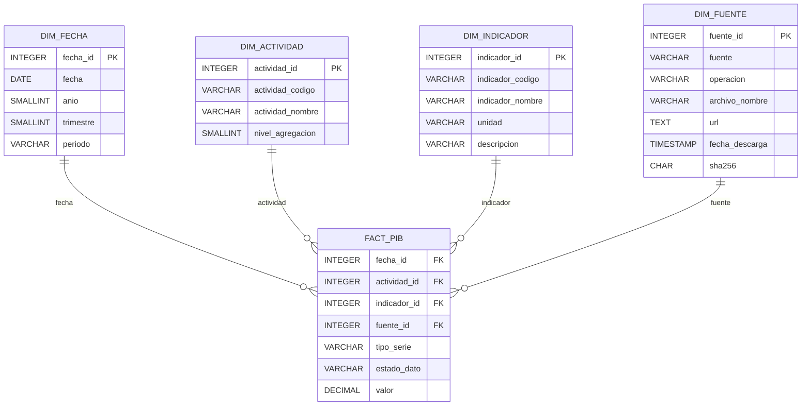

# PIB Data Contract

**Version:** 1.0.0  
**Status:** Contract specification  
**Scope:** Colombian quarterly GDP, production approach, DANE official publication

## 1. Purpose

This document is the formal and versioned data contract for the analytical GDP model of Colombia. It is the source of truth for the future transformer, validations, processed storage, Power BI integration, and future automation.

The contract defines a star schema that preserves DANE-published values and allows each observation to be traced to the exact source-file version from which it was ingested.

## 2. Scope

This contract covers the normalized analytical representation of the DANE quarterly GDP publication observed in `anex-ProduccionConstantes-IItrim2026.xlsx`:

- original data and data adjusted for seasonal and calendar effects;
- aggregation levels of 12, 25, and 61 groups;
- levels in billions of pesos and published growth indicators;
- quarterly periods and DANE publication states `p` and `pr`;
- economic activities and aggregate rows such as `Producto Interno Bruto`.

This document specifies the model only. It does not implement a transformer, downloader, pipeline, GitHub Actions workflow, storage process, dataset, or Power BI report.

## 3. Source

The source is the official DANE publication for national quarterly GDP using the production approach and constant prices. The primary structural evidence for this contract is documented in [the XLSX structure research](../research/dane-pib-xlsx-structure.md).

The inspected publication contained:

- `Cuadro 1` to `Cuadro 3`: original data at 12, 25, and 61 aggregation levels;
- `Cuadro 4` to `Cuadro 6`: data adjusted for seasonal and calendar effects at 12, 25, and 61 aggregation levels;
- periods arranged in columns with year and Roman-quarter header levels;
- vertical blocks for levels, growth rates, and year-to-date growth.

The source publication contains the concepts `Series encadenadas de volumen con año de referencia 2015` and `Miles de millones de pesos` in its observed headers and notes.

## 4. Architecture

The analytical architecture is a star schema. `fact_pib` is the central fact table and the four dimensions provide the descriptive context for every observation.

The source-file identity is carried by `dim_fuente` and referenced from the fact table. This permits multiple observations for the same economic period to coexist when they come from different published file versions.

## 5. Star Schema



All four dimensions have a `1:N` relationship to `fact_pib`.

## 6. Entity Definitions

### 6.1 `dim_fecha`

| Field | Type | Constraints | Definition |
|---|---|---|---|
| `fecha_id` | `INTEGER` | `PRIMARY KEY`, `NOT NULL` | Numeric period identifier. |
| `fecha` | `DATE` | `NOT NULL` | First day of the quarter. |
| `anio` | `SMALLINT` | `NOT NULL` | Calendar year. |
| `trimestre` | `SMALLINT` | `NOT NULL` | Quarter number from 1 to 4. |
| `periodo` | `VARCHAR(7)` | `NOT NULL` | Format `YYYY-QN`. |

Quarter dates are represented as follows:

- Q1: January 1;
- Q2: April 1;
- Q3: July 1;
- Q4: October 1.

Example: `fecha_id = 202602`, `fecha = 2026-04-01`, `anio = 2026`, `trimestre = 2`, `periodo = 2026-Q2`.

This representation supports temporal modeling and filtering in Power BI.

### 6.2 `dim_actividad`

| Field | Type | Constraints | Definition |
|---|---|---|---|
| `actividad_id` | `INTEGER` | `PRIMARY KEY`, `NOT NULL` | Surrogate dimension identifier. |
| `actividad_codigo` | `VARCHAR` | `NOT NULL` | Textual activity or aggregate code as published. |
| `actividad_nombre` | `VARCHAR` | `NOT NULL` | Activity or aggregate name as published. |
| `nivel_agregacion` | `SMALLINT` | `NOT NULL` | DANE aggregation level. |

The currently observed aggregation levels are `12`, `25`, and `61`. No specific activity codes are prescribed by this contract. Codes must be preserved as text, including ranges or combined codes observed in the source. The initial natural key is `nivel_agregacion + actividad_codigo`, which must be `UNIQUE`.

The dimension may contain activity rows and macroeconomic aggregate rows present in the DANE tables, including `Producto Interno Bruto`; no additional taxonomy is assumed.

### 6.3 `dim_indicador`

| Field | Type | Constraints | Definition |
|---|---|---|---|
| `indicador_id` | `INTEGER` | `PRIMARY KEY`, `NOT NULL` | Dimension identifier. |
| `indicador_codigo` | `VARCHAR(40)` | `NOT NULL` | Controlled indicator code. |
| `indicador_nombre` | `VARCHAR(120)` | `NOT NULL` | Human-readable indicator name. |
| `unidad` | `VARCHAR(40)` | `NOT NULL` | Unit of the published value. |
| `descripcion` | `VARCHAR(255)` | Nullable | Optional description. |

Initial indicator catalog:

| Code | Meaning | Unit |
|---|---|---|
| `NIVEL` | Published level | `COP_MILES_MILLONES` |
| `CRECIMIENTO_ANUAL` | Published annual growth rate | `PORCENTAJE` |
| `CRECIMIENTO_TRIMESTRAL` | Published quarterly growth rate | `PORCENTAJE` |
| `CRECIMIENTO_ANO_CORRIDO` | Published year-to-date growth rate | `PORCENTAJE` |

These indicators represent information published by DANE. They must not be replaced by internally calculated values.

### 6.4 `dim_fuente`

| Field | Type | Constraints | Definition |
|---|---|---|---|
| `fuente_id` | `INTEGER` | `PRIMARY KEY`, `NOT NULL` | Source identifier. |
| `fuente` | `VARCHAR(50)` | `NOT NULL` | Source institution or publication source. |
| `operacion` | `VARCHAR(100)` | `NOT NULL` | Statistical operation. |
| `archivo_nombre` | `VARCHAR(255)` | `NOT NULL` | Exact downloaded filename. |
| `url` | `TEXT` | `NOT NULL` | Official source URL. |
| `fecha_descarga` | `TIMESTAMP` | `NOT NULL` | Download timestamp. |
| `sha256` | `CHAR(64)` | `NOT NULL` | SHA-256 digest of the source file. |

The combination of source metadata and `sha256` must identify the exact file version used for an observation. `sha256` is a traceability and source-versioning field.

### 6.5 `fact_pib`

| Field | Type | Constraints | Definition |
|---|---|---|---|
| `fecha_id` | `INTEGER` | `FOREIGN KEY` to `dim_fecha.fecha_id`, `NOT NULL` | Observation period. |
| `actividad_id` | `INTEGER` | `FOREIGN KEY` to `dim_actividad.actividad_id`, `NOT NULL` | Economic activity or aggregate. |
| `indicador_id` | `INTEGER` | `FOREIGN KEY` to `dim_indicador.indicador_id`, `NOT NULL` | Published measure. |
| `fuente_id` | `INTEGER` | `FOREIGN KEY` to `dim_fuente.fuente_id`, `NOT NULL` | Source-file version. |
| `tipo_serie` | `VARCHAR(40)` | `NOT NULL` | Original or adjusted series. |
| `estado_dato` | `VARCHAR(2)` | `NOT NULL` | DANE publication status. |
| `valor` | `DECIMAL` | `NOT NULL` | Published numeric value. |

`valor` stores the value published by DANE, including valid zero values.

## 7. Keys and Relationships

- Every dimension primary key is an `INTEGER` and is referenced by the corresponding foreign key in `fact_pib`.
- Every fact row must reference an existing row in all four dimensions.
- Dimension-to-fact cardinality is `1:N`.
- The dimensions describe the fact; they do not replace the published value or its source metadata.

## 8. Natural Keys

The natural identity of a fact observation is the following combination, which must be `UNIQUE`:

```text
fecha_id + actividad_id + indicador_id + fuente_id + tipo_serie + estado_dato
```

The inclusion of `fuente_id` is intentional. It allows different DANE file versions to retain separate observations for the same period and activity, so revisions are not silently overwritten. An artificial key must not be the only way to identify an observation.

For `dim_actividad`, the natural key is:

```text
nivel_agregacion + actividad_codigo
```

## 9. Allowed Values

### `tipo_serie`

Only the following values are initially allowed:

- `ORIGINAL`;
- `AJUSTADA_ESTACIONAL_CALENDARIO`.

These concepts derive from the observed distinction between `Cuadro 1` to `Cuadro 3` and `Cuadro 4` to `Cuadro 6`. Sheet or table names are extraction details and must not be used as analytical values. For example, `cuadro_1`, `cuadro_2`, and `cuadro_4` are invalid `tipo_serie` values.

### `estado_dato`

The published DANE codes must be preserved exactly:

- `p`;
- `pr`.

The observed publication notes associate `p` with provisional and `pr` with preliminary. A future presentation layer may provide a friendly interpretation, but the original codes remain the contractual values. New states must not be accepted silently: they must be detected, fail validation, be documented, and trigger a contract review.

### Other controlled domains

- `dim_actividad.nivel_agregacion`: `12`, `25`, or `61` until a new contract version documents additional levels.
- `dim_indicador.indicador_codigo`: codes defined in `dim_indicador` only.
- `dim_fecha.trimestre`: `1`, `2`, `3`, or `4` only.

## 10. Data Types

The authoritative field types and constraints are those specified in the entity tables in Section 6. In particular:

- dates use `DATE` and timestamps use `TIMESTAMP`;
- identifiers use `INTEGER`;
- year and aggregation values use `SMALLINT`;
- `periodo` has maximum length 7 and format `YYYY-QN`;
- the source digest uses exactly `CHAR(64)`;
- numeric observations use `DECIMAL`;
- text fields use the declared maximum lengths where specified.

## 11. Data Quality Rules

The future ingestion and validation process must enforce at least the following rules:

### Referential integrity

Every fact foreign key must match an existing dimension key. No fact observation may exist without an identifiable source row.

### Uniqueness

The fact natural key must not be duplicated. The `dim_actividad` natural key must not be duplicated.

### Periods

`trimestre` must be one of `1`, `2`, `3`, or `4`. `fecha` must represent the first day of that quarter, and `periodo` must follow `YYYY-QN`.

### Activities

`nivel_agregacion` must be one of `12`, `25`, or `61` until a later contract version expands the domain.

### Indicators

Every fact indicator must be defined in `dim_indicador`.

### Series and states

`tipo_serie` must be `ORIGINAL` or `AJUSTADA_ESTACIONAL_CALENDARIO`. `estado_dato` must be `p` or `pr`, exactly as published.

### Values

`valor` must be numeric and non-null. Explicit zeros are valid values and must not be converted to null.

### Source digest

`dim_fuente.sha256` must contain exactly 64 hexadecimal characters.

### Published values

The stored value must be the value published by DANE. The ingestion process must not silently substitute a value calculated internally.

### Structural change detection

Future validations should detect unexpected changes in source sheets, aggregation levels, headers, periods, publication states, and relevant source metadata before accepting a new publication.

## 12. Data Lineage

The intended lineage is:

```text
DANE
  -> Official DANE page
  -> XLSX
  -> SHA-256
  -> Raw
  -> Transformation
  -> Star schema
  -> Power BI
```

Every observation must be traceable to:

- source institution and operation;
- exact filename;
- official URL;
- download timestamp;
- SHA-256 digest.

The source row, sheet, and other extraction diagnostics may be retained by a future implementation as additional lineage metadata, but they are not part of the analytical fact contract defined here.

## 13. Raw vs Processed

The planned storage architecture is:

```text
data/
├── raw/
└── processed/
```

`raw/` will contain original downloaded files without analytical transformation. This contract does not decide whether raw files will be committed to Git.

`processed/` will contain normalized data consumed by analytical layers. Analytical formats such as Parquet are planned for a later implementation, but no storage is implemented by this contract.

## 14. Versioning and Revisions

The source version is identified through `dim_fuente`, especially the SHA-256 digest. When DANE republishes a period with a different file version or value, the previous source version must not be silently overwritten during ingestion or version management.

Conceptually, both of the following may coexist:

```text
2025-Q4 | value 2.1 | source SHA-256 AAA...
2025-Q4 | value 2.3 | source SHA-256 BBB...
```

The mechanism for storing and querying revisions is outside the scope of this contract. This document defines only the preservation rule.

## 15. Published vs Derived Metrics

### Published by DANE

The model preserves the following published information:

- level;
- annual growth;
- quarterly growth;
- year-to-date growth;
- publication state;
- series type.

### Future derived metrics

The following are analytical derivations and must not replace the published values:

- sector shares;
- contributions to growth;
- rankings;
- moving averages;
- deviations;
- maxima and minima;
- changes in shares;
- composite economic indicators.

Derived calculations belong to later analytical layers.

## 16. Power BI Consumption

The intended consumption pattern is:

```text
Dimensions
  -> FACT_PIB
  -> DAX measures
```

Power BI will be responsible for the semantic layer and derived metrics. This contract does not define DAX. The dimensional structure is designed to support temporal slicing through `dim_fecha`, activity analysis through `dim_actividad`, indicator selection through `dim_indicador`, and source/revision traceability through `dim_fuente`.

## 17. Future Evolution

Future contract versions may expand the controlled domains or add fields when a new official publication or source requires them. Such changes must be explicit and versioned.

Potential evolution areas include:

- additional DANE indicators or series types observed in later publications;
- additional aggregation levels;
- confirmed semantics for empty cells within temporal data areas;
- additional lineage fields needed for structural diagnostics;
- integration with other official economic sources.

New values must not be accepted silently when they affect a controlled domain. The contract must be updated before those values become valid analytical data.

## 18. Open Questions

The following items remain intentionally open because they were marked as pending in the XLSX research and are not resolved by this documentation task:

1. Confirm with DANE methodology whether the year-to-date growth semantics are identical across all future updates and table families.
2. Confirm whether a future publication introduces explicit indices, contributions, or other measures not observed in the inspected workbook.
3. Confirm whether empty cells inside temporal data areas always mean unavailable data, structural layout, or another condition. Empty descriptor cells are known to occur because of headers and merged cells.
4. Confirm whether the order or application of `p` and `pr` markers can change in future publications.
5. Confirm the future treatment of activity rows, subtotals, and macroeconomic aggregates if the source introduces a different taxonomy.
6. Define the implementation-level revision storage and query mechanism; this contract only requires that source versions are not silently overwritten.

These questions do not change the current star-schema contract. They must be resolved before implementing behavior that depends on them.

## 19. Change History

| Version | Date | Change |
|---|---|---|
| `1.0.0` | 2026-08-22 | Initial formal PIB data contract based on the observed DANE XLSX structure. |
