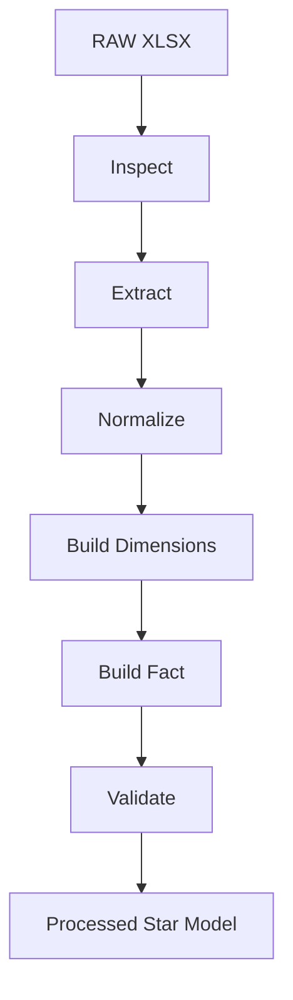
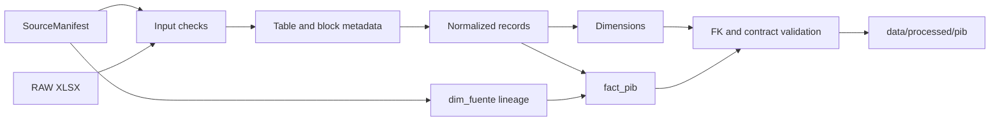

# PIB Transformer Technical Specification

**Version:** 1.0  
**Date:** 2026-08-22  
**Status:** Technical specification; not implemented

## 1. Purpose

This document specifies the future transformer that converts the official DANE quarterly GDP production XLSX at constant prices from its publication layout into the PIB star model. It defines discovery, extraction, normalization, dimension and fact construction, validation, lineage, observability, and compatibility rules.

The document is architectural only. It does not implement the transformer, create datasets, alter the data contract, or download a workbook.

## 2. Scope

The transformer starts with a validated RAW XLSX and its source manifest and ends with a validated PROCESSED star model. It must preserve published observations and their provenance.

It does not download files, resolve DANE URLs, modify RAW files, connect to Power BI, execute DAX, publish dashboards, or create CI/CD pipelines. URL resolution and download currently belong to `src/colombia_economic_intelligence/sources/dane_pib_resolver.py`.

## 3. Source Documents

Sources are applied in this order:

1. Existing repository code.
2. `docs/architecture/pib-data-model.md`.
3. `docs/research/dane-pib-xlsx-structure.md`.
4. Transformer specification constraints.

The research document inspected one real workbook and labels observations as observed, inferred, or pending. Its findings must not be treated as proof of historical stability.

The PIB data model is the approved data contract and defines what must be produced. This specification defines how the transformer constructs and validates that model; it does not redefine its schema, keys, types, relationships, or controlled values.

## 4. Architectural Context

The approved conceptual flow is:

```text
DANE -> RAW -> Transformation -> Star Model -> PROCESSED -> Power BI
```

The existing source component resolves a DANE constant-price production XLSX and creates a `SourceManifest` containing `source`, `operation`, `url`, `filename`, `download_timestamp`, `file_size_bytes`, and `sha256`, among other source metadata. The transformer consumes this manifest; it does not duplicate source resolution.



No independent repository-wide logging or configuration abstraction was found. Future implementation should reuse an established abstraction if one is introduced elsewhere before the transformer is built.

## 5. Input

The input is:

- a readable, valid XLSX file from the RAW area;
- the associated source manifest;
- explicit runtime configuration for input and output paths, expected structure, and process version where applicable.

The observed source is a DANE production, constant-price workbook with six data sheets and an index sheet. The transformer must inspect the workbook rather than trust a filename, fixed row numbers, or a fixed column range.

The source manifest is authoritative for URL, filename, download timestamp, and SHA-256. The workbook is authoritative for published periods, activities, indicators, series family, status markers, units, and source notes.

## 6. Output

The conceptual destination is `data/processed/pib/`. The initial strategy is a simple, non-partitioned analytical output unless volume or consumer requirements establish a clear need for partitioning.

The analytical model contains:

- `dim_fecha`;
- `dim_actividad`;
- `dim_indicador`;
- `dim_fuente`;
- `fact_pib`.

The Data Contract defines the exact schema. `fact_pib` contains `fecha_id`, `actividad_id`, `indicador_id`, `fuente_id`, `tipo_serie`, `estado_dato`, and `valor`. Its foreign keys are `INTEGER`, controlled text fields are non-null, and `valor` is a non-null `DECIMAL`. The dimensions and their fields, types, constraints, and relationships must be reproduced exactly from the Data Contract.

Parquet is the planned analytical format. Output files should use the Data Contract's stable column names and conceptual types, UTF-8 text encoding, and deterministic row ordering. The contract defines the logical outputs; the implementation may choose physical filenames without changing that schema.

## 7. Transformation Pipeline

The future pipeline is ordered and transactional in intent:

1. Verify the input file and manifest.
2. Inspect workbook sheets, merged cells, headers, notes, and candidate tables.
3. Detect the six expected data tables and classify them.
4. Extract only structurally identified observations.
5. Normalize periods, statuses, indicators, activities, and values.
6. Build dimensions using natural keys and deterministic surrogate keys where the contract requires them.
7. Resolve foreign keys and build `fact_pib`.
8. Run structural, referential, and business validations.
9. Emit output and coverage metrics only after validation succeeds.

Any critical validation failure aborts the run. Partial output must not be presented as a valid processed dataset.

## 8. Workbook Inspection

Inspection must record, at minimum:

- workbook readability and XLSX validity;
- visible and hidden sheets;
- sheet names and reported dimensions as diagnostic evidence;
- merged ranges and non-empty regions;
- candidate title, header, note, and data blocks;
- year and quarter header patterns;
- table family, aggregation level, indicators, units, and status markers.

The observed workbook has seven visible sheets: `Índice`, `Cuadro 1` through `Cuadro 6`. This is an expectation to validate, not a permanent positional contract. Unexpected critical sheets or missing expected tables must produce `StructureError`.

Physical coordinates may support diagnostics and regression tests, but labels, headers, patterns, metadata, content, and workbook structure are the primary detection mechanisms.

## 9. Table Detection

The expected conceptual mapping is:

| Family | Tables | Aggregation levels |
|---|---|---|
| Original | Cuadros 1, 2, 3 | 12, 25, 61 |
| Adjusted seasonal/calendar | Cuadros 4, 5, 6 | 12, 25, 61 |

Detection must identify the family from the table title or metadata describing `Datos originales` or `Datos ajustados por efecto estacional y calendario`, and identify the aggregation level from the CIIU heading: sections (12), sections and divisions (25), or divisions (61). Table numbers are useful as a consistency check, not the sole analytical rule.

The implementation must fail when an expected family-level combination is absent, when more than one candidate matches ambiguously, or when an unknown critical table structure is found. It must report sheet and detected labels in the error context.

Each table contains vertical blocks. The research observed blocks for levels, growth, and year-to-date growth. Block boundaries must be found from repeated block titles and headers, not only from observed row numbers.

## 10. Period Detection

Periods are column-oriented and use a two-level header: a year in an upper row and a Roman quarter (`I`, `II`, `III`, `IV`) in a lower row. The year must be forward-filled across its quarter columns after resolving merged cells and equivalent repeated-header representations.

For each temporal column the extractor must:

1. locate the header rows by structure;
2. resolve the effective year from the upper header, including merged cells;
3. resolve the quarter from the lower header;
4. separate status suffixes from the year (`2024p`, `2025pr`, `2026pr` in the observed workbook);
5. validate year and quarter;
6. emit the normalized period as `YYYY-QN`, while retaining the original header for lineage.

For example, `2026` plus `II` becomes `2026-Q2`. A missing year, invalid quarter, ambiguous header, or unpropagated year is a `PeriodError`. Periods must not be inferred from numeric values or from the filename alone. Provisional periods remain periods; their publication status is represented separately.

The observed workbook has no separate annual, accumulated, or interannual columns. This must be rechecked on every input.

## 11. Series Detection

`tipo_serie` is determined from the table family and its explicit publication label:

- `ORIGINAL` for the original-data family;
- `AJUSTADA_ESTACIONAL_CALENDARIO` for data adjusted for seasonal and calendar effects.

The value is never inferred from a numeric observation, and table names are not emitted as the analytical value. The original label and sheet/block origin should remain available in audit metadata.

Only these two contract values are accepted. A missing or unknown family is a `SeriesError`. Original and adjusted observations must not be merged as duplicates of one another or treated as interchangeable.

## 12. Data Status Detection

The contract-controlled values are `p` and `pr`. In the observed workbook, these markers are attached to years such as `2024p` and `2025pr`, and notes associate `p` with provisional and `pr` with preliminary. The transformer must preserve the published marker, not replace it permanently with a translated label.

Status extraction must operate on the effective period header and its associated notes. It must distinguish `p` from `pr` before parsing the year, retain the raw header and relevant note as audit evidence, and carry the status to every observation for that period/block where the workbook establishes that scope.

A missing, malformed, conflicting, or unknown status in a context where status is required is a `StateError`; it must not silently become null. The application of a marker across future header layouts remains subject to confirmation with additional publications.

## 13. Indicator Detection

The contract-controlled indicators are:

- `NIVEL`;
- `CRECIMIENTO_ANUAL`;
- `CRECIMIENTO_TRIMESTRAL`;
- `CRECIMIENTO_ANO_CORRIDO`.

Indicators are identified from the title and structure of each vertical block, including unit and series-family context. In the observed workbook, original tables expose level, annual growth, and year-to-date growth blocks; adjusted tables expose level, quarterly growth, and year-to-date growth blocks. The implementation must validate these semantics rather than assume them from table position.

A numeric cell alone never identifies an indicator. The same numeric representation can be a level in billions of pesos or a percentage. Unknown, missing, or contradictory block labels produce `IndicatorError`. Units must be checked alongside the indicator, but values must not be recalculated to derive a missing indicator.

The word `Índice` on the index sheet or in a title is not sufficient evidence of an additional indicator; explicit support must be confirmed first.

## 14. Activity Detection

Activity records are identified from descriptor columns and the table's CIIU context. Codes and names must be copied from the XLSX, including textual ranges or lists such as `003`, `009 - 012`, or `001, 002, 004 - 008, 013`; the first implementation must not expand or rewrite them.

The extractor must distinguish activity rows from structural rows by requiring the applicable activity code and concept/name, checking the row's position inside a detected data block, and recognizing structural labels such as headers, subtitles, notes, separators, metadata, and blank rows. Numeric cells do not make a row an activity.

`Producto Interno Bruto` belongs in `dim_actividad` and is represented in `fact_pib` with the same dimensions as other observations. No `fact_pib_total` or special total table is created. The Data Contract permits activity and macroeconomic aggregate rows in this dimension. The observed PIB code is `B.1b`, but codes must always be read from the workbook and not hardcoded.

Missing required code/name, a row that cannot be classified, or a level inconsistent with the table's CIIU heading produces `ActivityError` or `StructureError` with sheet and row context. The transformer must construct the contract's `dim_actividad` without adding an entity-type field or moving aggregate rows to another table.

## 15. Value Normalization

Normalization converts the Excel cell representation to a numeric value only after the cell's indicator, unit, period, activity, and status context has been identified.

Rules:

- preserve numeric Excel values, including negative values and explicit zero;
- preserve precision supplied by the workbook; do not round unnecessarily;
- treat genuinely empty temporal cells according to a documented, block-specific missing-data rule confirmed during implementation; never confuse merged/header emptiness with a missing observation;
- parse formatting and separators only with locale-aware, explicit rules;
- interpret percentage formatting only in the context of a growth indicator and preserve the published economic value rather than recomputing it;
- do not convert `-`, `--`, `...`, `N.D.`, `ND`, `NA`, `no disponible`, `no aplica`, notes, or other non-numeric text to null without an approved semantic rule;
- preserve explicit zeros as zero;
- fail with `ValueError` when a value is expected but unreadable, incompatible with its block, or ambiguously formatted.

No value is recalculated, economically adjusted, or silently replaced. Raw cell representation and source coordinates should be retained in diagnostics where practical.

## 16. Dimension Construction

The Data Contract defines the schema; this specification defines the construction process. Dimensions are built from normalized records and source metadata after validation of their source attributes. The transformer must emit the following contract fields and constraints:

| Dimension | Origin | Natural identity and rules |
|---|---|---|
| `dim_fecha` | Normalized period | `fecha_id INTEGER` primary key; `fecha DATE` is the first day of the quarter; `anio SMALLINT`; `trimestre SMALLINT` in 1-4; `periodo VARCHAR(7)` in `YYYY-QN`; all are non-null. Use the contract's deterministic period identifier, e.g. `202602` for 2026-Q2. |
| `dim_actividad` | Workbook code, concept/name, and CIIU aggregation context | `actividad_id INTEGER` primary key; `actividad_codigo VARCHAR`, `actividad_nombre VARCHAR`, and `nivel_agregacion SMALLINT` are non-null. Natural key is `nivel_agregacion + actividad_codigo` and must be unique. |
| `dim_indicador` | Detected block label and unit context | `indicador_id INTEGER` primary key; `indicador_codigo VARCHAR(40)`, `indicador_nombre VARCHAR(120)`, and `unidad VARCHAR(40)` are non-null; `descripcion VARCHAR(255)` is nullable. One row per controlled indicator/unit identity. |
| `dim_fuente` | `SourceManifest` and workbook notes | `fuente_id INTEGER` primary key; `fuente VARCHAR(50)`, `operacion VARCHAR(100)`, `archivo_nombre VARCHAR(255)`, `url TEXT`, `fecha_descarga TIMESTAMP`, and `sha256 CHAR(64)` are non-null. The source metadata plus SHA-256 identifies the file version. |

All dimension primary keys are `INTEGER` and are referenced by the corresponding fact foreign key. Generate or resolve them according to the Data Contract; they must be stable for the same logical input and must not depend on execution timestamp, hash-map order, or row discovery accidents. Deduplication is an explicit natural-key operation; it is not a silent `drop_duplicates()`.

## 17. Fact Construction

For each normalized observation, resolve:

- `fecha_id` from `dim_fecha`;
- `actividad_id` from `dim_actividad`;
- `indicador_id` from `dim_indicador`;
- `fuente_id` from `dim_fuente`;
- `tipo_serie` from validated table-family detection;
- `estado_dato` from validated period/header status;
- `valor` from validated value normalization.

The natural identity of a fact observation is:

```text
fecha_id + actividad_id + indicador_id + fuente_id + tipo_serie + estado_dato
```

This combination must be unique. A duplicate is a `DuplicateError`, never a row silently discarded or selected by order. The diagnostic must include period, activity, indicator, series, status, source, sheet, block, and source row/column where available.

Foreign-key resolution happens before output. Missing or multiple dimension matches produce `ReferentialIntegrityError`. Fact values must be numeric and all controlled categorical fields must be validated before serialization.

## 18. Data Quality Validation

### File validation

- input exists and is readable;
- XLSX container is valid and parseable;
- SHA-256 is calculable and agrees with the manifest when both are available;
- source manifest has the required lineage fields.

### Workbook and structure validation

- expected workbook structure is present;
- six data tables and their two families are detected;
- no critical unknown structure is ignored;
- headers, merged cells, notes, blocks, and temporal regions are coherent.

### Domain validation

- period format is `YYYY-QN`, quarter is 1 through 4, and year is valid;
- no expected period is lost during normalization;
- activity code/name requirements are met and aggregation level is one of 12, 25, 61;
- indicator is one of the four contract values;
- series is one of `ORIGINAL`, `AJUSTADA_ESTACIONAL_CALENDARIO`;
- status is one of `p`, `pr`;
- values expected to be numeric are numeric;
- every fact foreign key resolves;
- fact natural identity is unique.

Validation reports must identify the stage, category, source location, and enough business context to reproduce the failure.

## 19. Business Validation

Business checks are sanity checks only and must never mutate observations or introduce undocumented economic relationships. At minimum, validate:

- `Producto Interno Bruto` exists in `dim_actividad` and has expected observations;
- periods exist and have usable coverage;
- expected indicators exist for the detected table families;
- units are coherent with indicators, especially levels versus percentages;
- activities use a valid aggregation level for their table;
- both series families have the coverage expected from the source publication.

The checks must not calculate GDP, reconstruct growth rates, infer missing values, or assert relationships that are not documented by DANE or the data contract.

## 20. Error Handling

The conceptual error categories are:

| Category | Meaning |
|---|---|
| `FileError` | Missing, unreadable, or invalid input file/manifest. |
| `StructureError` | Unexpected workbook, table, header, block, or row structure. |
| `PeriodError` | Invalid, ambiguous, or lost period. |
| `ActivityError` | Invalid or unclassifiable activity. |
| `IndicatorError` | Missing, unknown, or contradictory indicator block. |
| `SeriesError` | Missing or unknown series family. |
| `StateError` | Missing, malformed, or unknown publication status. |
| `ValueError` | Incompatible or unreadable expected value. |
| `DuplicateError` | Repeated natural observation identity. |
| `ReferentialIntegrityError` | Missing or ambiguous dimension foreign key. |

The future implementation may use a different naming convention, but it must preserve these distinctions or document an explicit mapping. Every error must include stage, cause, and context such as file, sheet, block, period, activity, indicator, series, status, source, and coordinates where available. Critical errors fail fast and prevent valid-looking partial output.

## 21. Logging and Observability

The future transformer should emit structured records, using the repository's logging convention if one is established. At minimum:

**Start:** input filename/path, process version if available, and timestamp.  
**Inspection:** sheets, detected tables, periods, aggregation levels, families, and blocks.  
**Extraction:** records found by sheet, block, family, level, and indicator.  
**Validation:** error count, duplicate count, invalid-value count, and validation outcomes.  
**Output:** records generated, dimensions generated, output location, file hashes if produced, and completion status.

Coverage metrics must be generated for later logs, tests, and CI observability:

```text
Source: DANE PIB
Periods: YYYY-QN -> YYYY-QN
Aggregation: 12 / 25 / 61
Series: Original / Adjusted
Indicators: count
Records: count
Duplicates: 0
Invalid records: 0
```

Counts must be derived from accepted normalized records and must not conceal rejected records. The output should also expose the rejection/error counts and their categories.

## 22. Idempotency

For the same XLSX bytes, same manifest, and same configuration:

```text
same XLSX + same configuration = same logical result
```

Determinism requires stable parsing rules, natural-key deduplication with failure on conflicts, deterministic dimension ordering/keys, stable output ordering, and no dependence on current time or discovery order. Download or execution timestamps must not alter analytical content. They may appear only as explicit metadata such as `fecha_descarga` in source lineage.

## 23. Data Lineage

Every fact observation must be traceable through `dim_fuente` to:

```text
DANE -> operation -> filename -> URL -> download date -> SHA-256 -> transformation -> final observation
```

The source dimension must preserve the contract-defined fields `fuente`, `operacion`, `archivo_nombre`, `url`, `fecha_descarga`, and `sha256`. The current manifest calls the filename `filename` and the download timestamp `download_timestamp`; the implementation must map these to the contract without losing the original values. Sheet, block, source row/column, raw period header, and raw status text should be retained in audit metadata where the model permits.

A fact without a resolvable source record is invalid.

## 24. Output Strategy

The target location is `data/processed/pib/`. Parquet is the planned analytical format, with explicit schema and UTF-8 string columns. The initial output should be simple and non-partitioned, because the current evidence does not establish a performance need for partitioning. If partitioning is later introduced, it must be documented and deterministic, and it must not change the logical schema.

Expected logical outputs are exactly the four dimensions and `fact_pib`, with the tables, fields, types, nullability, keys, relationships, and controlled domains defined by `docs/architecture/pib-data-model.md`. No output files are created by this specification.

## 25. Testing Strategy

No tests are created in this task. The future implementation should include:

### Unit tests

- period parsing, year propagation, and `p`/`pr` extraction;
- table/family and aggregation-level detection;
- indicator block detection and unit compatibility;
- activity versus structural-row classification;
- numeric, empty, negative, zero, percentage, separator, and invalid-value normalization.

### Integration tests

- a real or representative DANE XLSX;
- extraction of all six tables and blocks;
- dimension and fact construction;
- structural, business, and referential validation;
- manifest/hash lineage.

### Regression tests

Use snapshots or fixtures of previously processed workbooks and detected structure to identify DANE header, merge, note, period, and table changes.

### Data quality tests

- natural-key duplicates;
- foreign keys;
- period and series coverage;
- numeric values and explicit zeros;
- controlled indicators and statuses;
- presence of PIB total;
- lineage completeness.

The existing repository tests validate the HTML source resolver with fixtures; they do not test XLSX transformation behavior.

## 26. Future Compatibility

Compatible changes may include additional periods, new activity rows within a known CIIU level, and minor header text changes that still match validated semantic labels and units. The parser may accept these after structural validation and should report them in coverage/logs.

Critical changes include missing or ambiguous expected tables, an unrecognized table family, an unknown aggregation level, changed block semantics, invalid temporal headers, unknown indicator/status/series values, incompatible units, or a new structure that cannot be classified confidently. These changes must fail fast and identify the evidence that changed.

A new aggregation level, indicator, status, or series must not be accepted silently. It requires review, documentation, and a corresponding data-contract decision. The parser should be tolerant of known harmless variation but must not become a generic parser that accepts any plausible-looking spreadsheet.

## 27. Architecture Constraints

The future code may be organized conceptually as:

```text
src/pib/
    inspect.py
    extract.py
    normalize.py
    dimensions.py
    fact.py
    validate.py
    pipeline.py
```

Responsibilities:

- `inspect.py`: discover workbook structure;
- `extract.py`: extract structurally identified records;
- `normalize.py`: normalize periods, states, activities, indicators, and values;
- `dimensions.py`: construct dimensions;
- `fact.py`: resolve keys and construct `fact_pib`;
- `validate.py`: run structural and quality checks;
- `pipeline.py`: orchestrate the process.

This is a conceptual layout, not an instruction to create these files. Before implementation, reuse an equivalent repository structure if one exists. The transformer must not download or resolve URLs, modify RAW, connect to Power BI, execute DAX, or publish dashboards. Paths, URLs, names, and parser parameters must be configurable rather than hardcoded; no configuration system is currently confirmed in the repository.



## 28. Open Questions

The following questions remain open because they concern future DANE publications or implementation policy, not the approved star-schema contract:

1. **What is the exact meaning of an empty temporal cell?** The inspected workbook contains empty cells caused by descriptors, merged headers, and areas without data, but one publication is insufficient to establish missing-data semantics. This affects whether an empty cell is omitted or treated as an error. Recommendation: confirm with multiple DANE publications and methodology; fail when an expected value is ambiguous until the rule is approved.

2. **Are status markers scoped consistently across all blocks and future updates?** The observed workbook uses `p` and `pr` in year headers and explanatory notes, but the scope/order may change. This affects status propagation to facts. Recommendation: add fixtures covering status scope and require an explicit structural match.

3. **Are block semantics stable across future updates?** The research observes annual growth in original tables and quarterly growth in adjusted tables, while year-to-date growth appears in both. This affects indicator mapping and unit validation. Recommendation: confirm against DANE methodology and later workbooks; fail on semantic drift.

4. **Should the current manifest's quarter inference be extended for names such as `IItrim2026`?** The resolver currently leaves that observed filename pattern unmatched while workbook headers identify the period. This affects manifest metadata, not workbook extraction. Recommendation: address in the source-resolver scope after confirming ownership; the transformer must rely on workbook headers for analytical periods.

5. **How should revisions be stored and queried physically?** The Data Contract requires source versions to coexist and not be silently overwritten, but leaves the implementation mechanism outside its scope. Recommendation: define this in the storage implementation while preserving `fuente_id` and SHA-256 in the fact lineage.

## 29. Change History

| Version | Date | Change |
|---|---|---|
| v1.0 | 2026-08-22 | Initial PIB transformer technical specification, aligned with the approved PIB data contract. |
